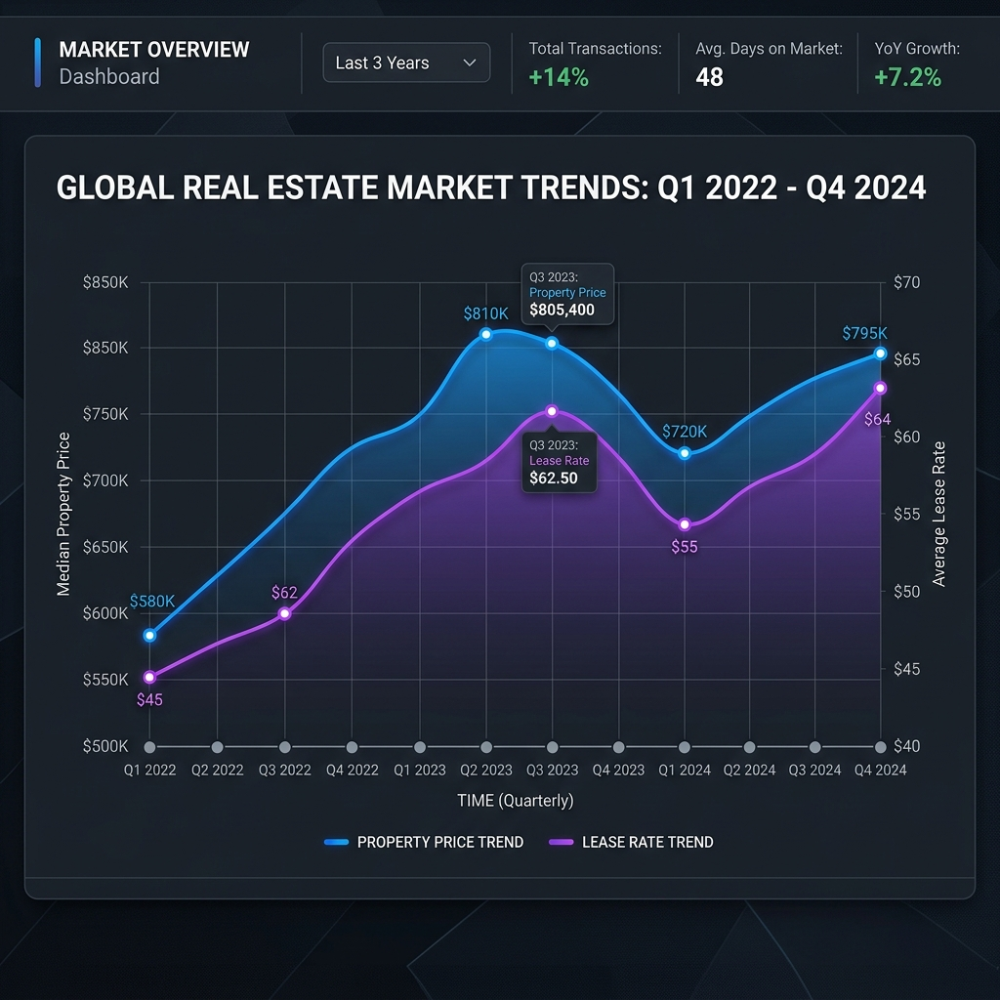
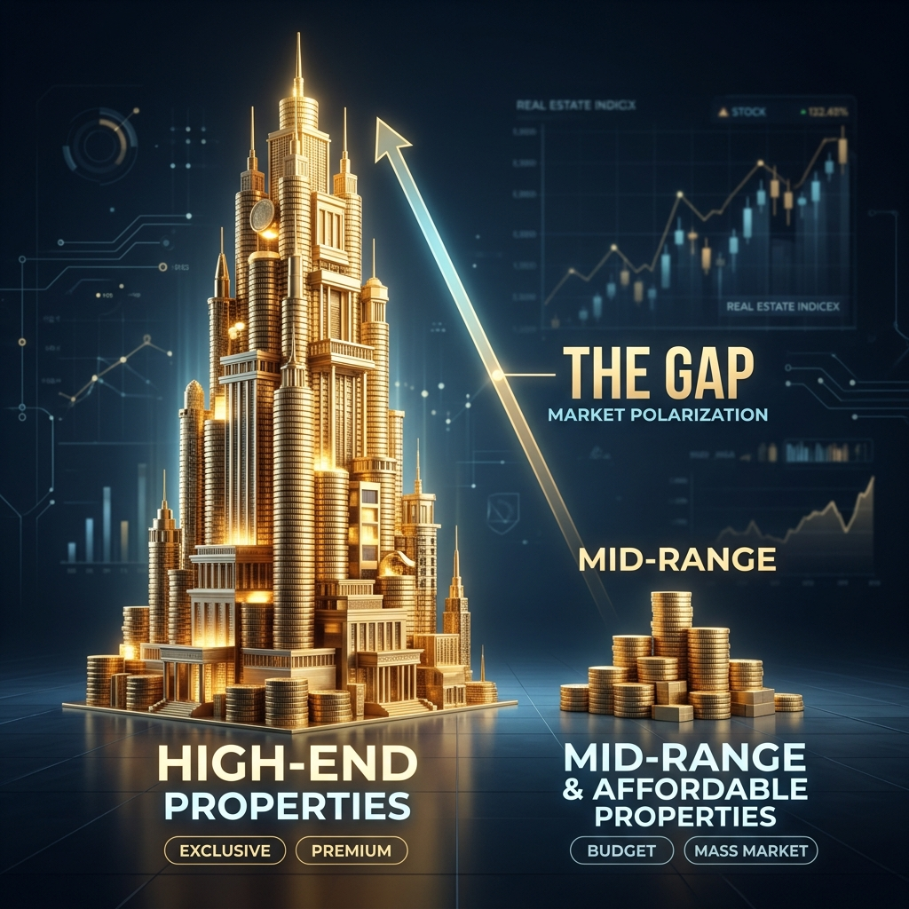
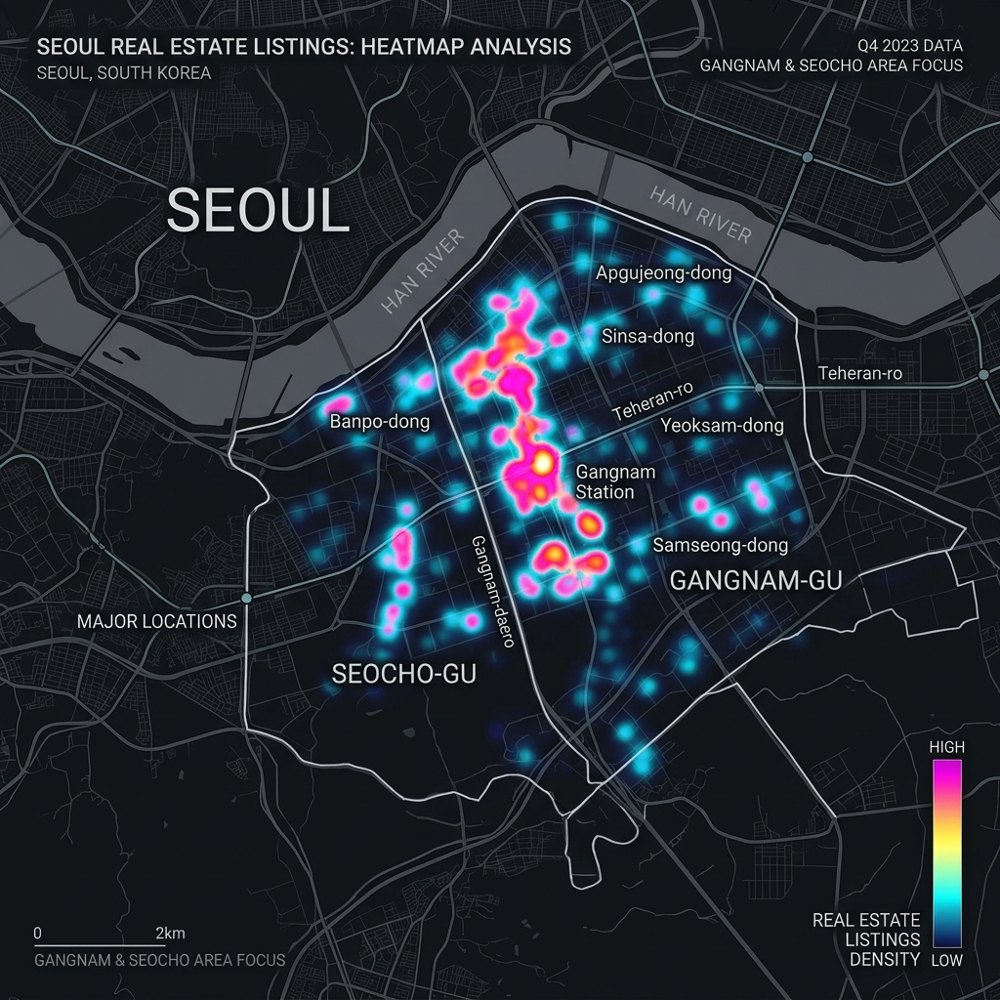

# <!-- fit --> 📊 NEMO DATA
## 전략 보고서 v2.0

**수석 데이터 분석가 리포트**
2026-04-28

---

## 01. 시장 인사이트
### MARKET INSIGHTS

1. **'초양극화'** (Hyper-Gap)
2. **'실용성 중심'** (Utility First)
3. **'데이터 가격'** (Data-Driven)

---

### 1.1 구조적 특징

- **정교한 임대료 체계**
  - 상관계수 **0.82** (Extreme)
- **자산 양극화 현상**
  - 권리금 평균 **4.2억**
  - **중앙값 0원!** (상위 독점)

---

### 1.2 지역 집중도

- **'GOLDEN TRIANGLE'**
  - **역삼동(108.4)** 압도적
  - 서초동(58.1)
  - 강남역(55.4)
- **핵심 상권**
  - 테헤란로 & 강남대로 집중

---

## 02. 세부 지표 분석

| 분석 지표 | 평균 (Mean) | 중앙값 (Med) |
| :--- | :---: | :---: |
| **보증금** | 6.13억 | **4.00억** |
| **권리금** | 4.26억 | **0원** |
| **월세** | 5,500만 | **3,800만** |

> **⚠️ 경고** : 평균의 함정에 빠지지 마십시오. 중앙값이 시장의 실체입니다.

---

## 03. 핵심 인사이트

- **업종 분포**: 
  - 범용 공간 비중 **50% 상회**
- **가격 유형**: 
  - 임대 매물 **98.9%** (압도적)
- **필터링 조건**: 
  - **'인테리어', '역세권', '1층'**

---

## 04. 전략 제언

- **임차인 전략**
  - **무권리 시장** 집중 공략
  - 인테리어 승계로 비용 절감
- **임대인 전략**
  - **유연한 공간** (Flex) 구성
  - 공실 리스크 선제 대응

---

# <!-- fit --> 💡 MISSION COMPLETE
**Nemo Data Team**

*1,071건의 데이터가 증명하는 필승 전략*
